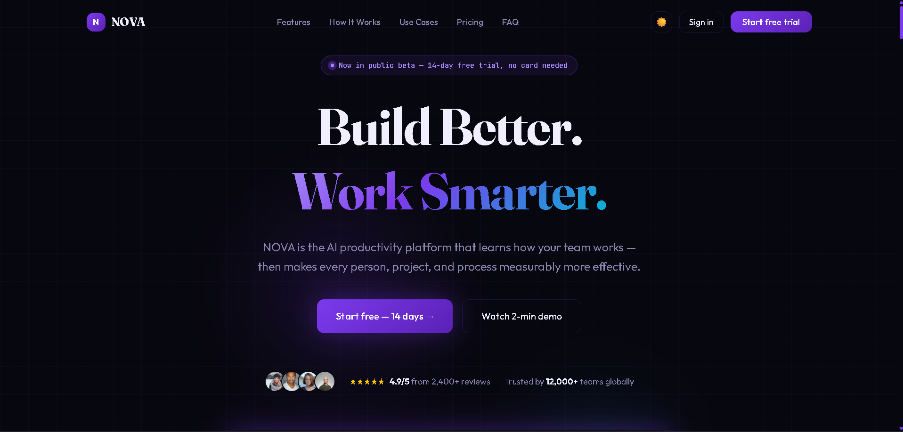
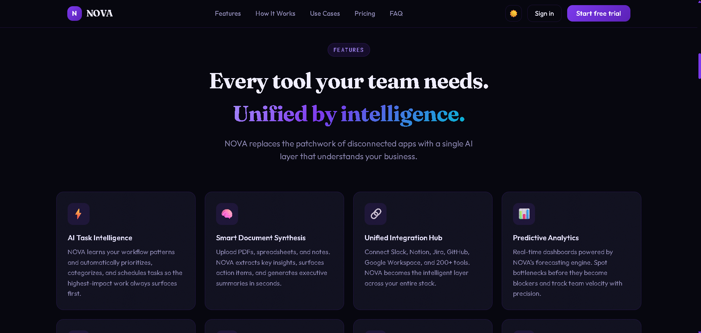
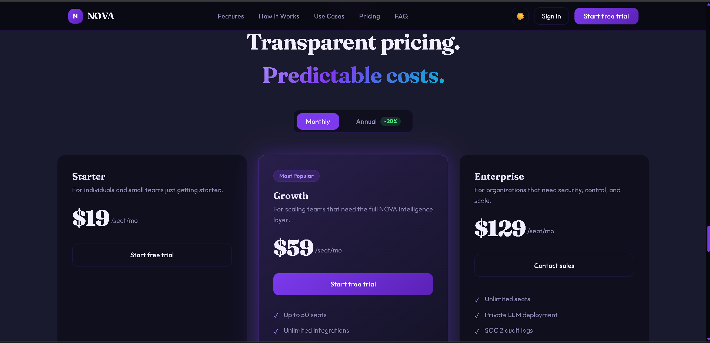
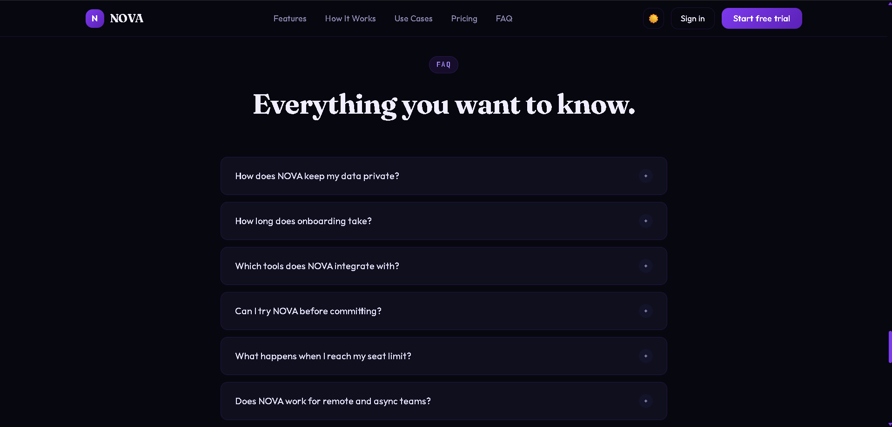
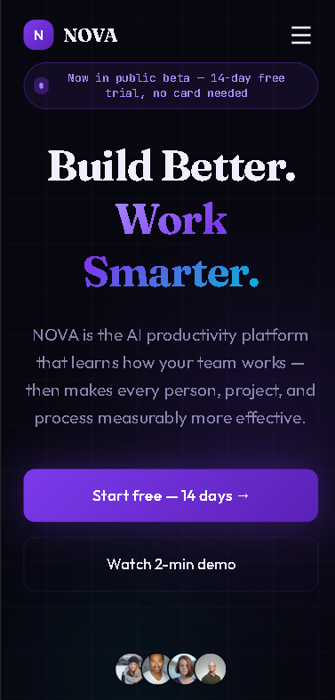
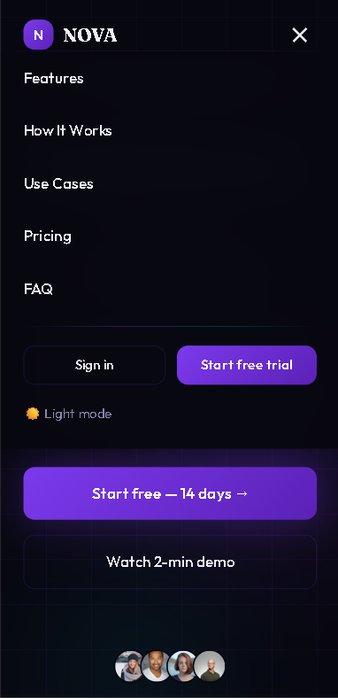
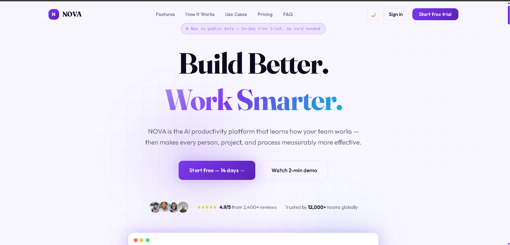

# NOVA — AI Productivity Platform

> **Build Better. Work Smarter.**

NOVA is a modern, responsive SaaS landing page for a fictional AI-powered productivity platform. The website is designed to demonstrate modern front-end development, responsive UI/UX, reusable React components, interactive elements, animations, accessibility, and clean project organization.

---

## 🚀 Project Description

NOVA is an AI productivity platform concept designed to help modern teams work more efficiently by bringing task management, analytics, collaboration, integrations, and AI-powered insights into one unified platform.

The landing page presents NOVA's product capabilities through a polished SaaS-style interface with responsive layouts for desktop, laptop, tablet, and mobile devices.

---

## 🛠️ Technologies Used

- **React** — Component-based UI development
- **Vite** — Fast development and build tooling
- **JavaScript (JSX)** — Application logic and components
- **Tailwind CSS v4** — Responsive styling and utility classes
- **CSS** — Custom animations, gradients, themes, and visual effects
- **Google Fonts** — Fraunces, Outfit, and JetBrains Mono
- **Intersection Observer API** — Scroll-based section animations
- **CSS Variables** — Dark/light theme system

---

## ✨ Features

- Responsive navigation bar
- Mobile hamburger menu
- Smooth scrolling navigation
- Hero section with product dashboard preview
- Trusted-by company logo ticker
- 8 product features
- Product/About NOVA section
- How It Works section
- Animated statistics counters
- Solutions/use cases for different teams
- Testimonial carousel with automatic rotation
- Monthly/annual pricing toggle
- Three pricing plans
- Expandable FAQ accordion
- Final CTA with email validation
- Newsletter-style email form
- Dark/light mode toggle
- Card hover animations
- Button hover effects
- Scroll reveal animations
- Back-to-top button
- Responsive layouts across screen sizes
- Semantic HTML structure
- Basic accessibility attributes
- Reusable React components
- Separated static content and reusable hooks

---

## 📂 Project Structure

```text
nova-landing-page/
│
├── public/
│
├── src/
│   ├── assets/
│   │
│   ├── components/
│   │   ├── Navbar.jsx
│   │   ├── Hero.jsx
│   │   ├── TrustedBy.jsx
│   │   ├── Features.jsx
│   │   ├── ProductAbout.jsx
│   │   ├── HowItWorks.jsx
│   │   ├── Statistics.jsx
│   │   ├── StatCounter.jsx
│   │   ├── UseCases.jsx
│   │   ├── Testimonials.jsx
│   │   ├── Pricing.jsx
│   │   ├── FAQ.jsx
│   │   ├── FinalCTA.jsx
│   │   ├── Footer.jsx
│   │   └── BackToTop.jsx
│   │
│   ├── data/
│   │   └── content.js
│   │
│   ├── hooks/
│   │   ├── useIntersection.js
│   │   └── useCounter.js
│   │
│   ├── App.jsx
│   ├── App.css
│   ├── index.css
│   └── main.jsx
│
├── .gitignore
├── eslint.config.js
├── index.html
├── package.json
├── package-lock.json
├── README.md
└── vite.config.ts
```

## 🌐 Live Demo

Live Demo:

https://agent-6aa0f5fe81a8252e86d6c555--novalanding-page.netlify.app/

## 🤖 AI Tools Used

This project was created with assistance from AI-powered design and development tools.

Figma AI / Figma Make

Used to generate and develop the initial website design and UI concepts.

ChatGPT

Used for:

- Code organization
- React component restructuring
- Debugging
- Implementation guidance
- Responsive design improvements
- Documentation
- AI-Assisted Development

AI assistance was also used to improve:

- Componentization
- Responsive behavior
- Interactive elements
- Project structure
- UI interactions

## ⚙️ Installation Instructions

### 1. Clone the repository

Clone the NOVA repository to your local machine:

```bash
git clone https://github.com/Arcane-stack/nova-landing-page.git
```
### 2. Navigate into the project directory

Open your terminal and move into the project folder:

```cd nova-landing-page```
### 3. Install the required dependencies

Install all project dependencies using npm:

```npm install```
### 4. Start the development server

Run the following command to start the Vite development server:

```npm run dev```
### 5. Open the website

After the development server starts, Vite will display a local URL in the terminal.

It will usually be:

### http://localhost:5173

Open the URL in your web browser to view the NOVA landing page.

### 🏗️ Build for Production

To create an optimized production build, run:

```npm run build```

The production-ready files will be generated in the dist folder.

Preview the production build

To preview the production build locally, run:

```npm run preview```

Vite will provide a local URL where you can view the production version of the website.

## SCREENSHOTS
**DESKTOP VIEW OF HERO SECTION**

**FEATURES SECTION**

**PRICING SECTION**

**FAQ SECTION**

**MOBILE VIEW**

**MOBILE HAMBURGER MENU**

**LIGHT THEME**


